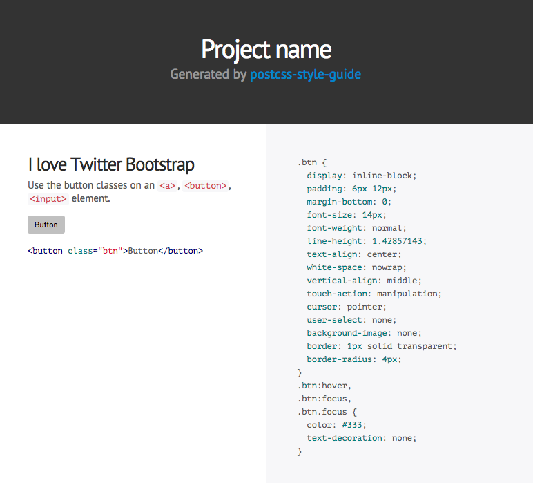

# postcss-style-guide [](https://travis-ci.org/morishitter/postcss-style-guide)

[PostCSS](https://github.com/postcss/postcss) plugin to generate a style guide automatically.

CSS comments will be parsed through Markdown and displayed in a generated HTML document.

## Install

```shell
$ npm install postcss-style-guide
```

## Example

Node.js:

```js
var fs = require('fs');
var postcss = require('postcss');
var styleguide = require('postcss-style-guide');
var input = fs.readFileSync('input.css', 'utf8');

var output = postcss([
  styleguide
]).process(input)
.then(function (reuslt) {
  var output = fs.readFileSync('styleGuide/index.html', 'utf8');
  console.log('output:', output);
});
```

in [Gulp](https://github.com/gulpjs/gulp):

```js
var gulp = require('gulp')

gulp.task('build:css', function () {
    var concat = require('gulp-concat')
    var postcss = require('gulp-postcss')
    var autoprefixer = require('autoprefixer')
    var customProperties = require('postcss-custom-properties')
    var Import = require('postcss-import')
    var styleGuide = require('postcss-style-guide')
    var nano = require('cssnano')

    return gulp.src('./app.css')
        .pipe(postcss([
            Import,
            customProperties({ preserve: true }),
            autoprefixer,
            styleGuide({
                project: 'Project name',
                dest: 'styleguide/index.html',
                showCode: false,
                themePath: '../'
            }),
            nano
        ]))
        .pipe(concat('app.min.css'))
        .pipe(gulp.dest('dist/css'))
})
```

We can generate color palette from CSS Custom Properties with `@start color` and `@end color` annotations.

`app.css`:

```css
@import "color";
@import "button";
```

`color.css`:

```css
import "button";
/* @start color */
:root {
    --red: #e23B00;
    --blue: #3f526b;
    --black: #000;
    --background: #faf8f5;
}
/* @end color */
```

postcss-style-guide generate style guide from CSS comments that have special annotation(`@styleguide`).

`@title`: set component name

`button.css`:

```css
/*
@styleguide

@title Button

Use the button classes on and `<a>`, `<button>`, `<input>` elements.

<button class="button button--large button--red">Red Button</button>

    <button class="button button--large button--red">Red Button</button>

<button class="button button--large button--blue">Red Button</button>

    <button class="button button--large button--blue">Red Button</button>
*/
.button {
    display: flex;
    align-items: center;
    justify-content: center;
    border-radius: 6px;
    cursor: pointer;
}

.button--large {
    width: 140px;
    height: 40px;
    font-size: 14px;
}

.button--red {
    color: #fff;
    background-color: var(--red);
}

.button--blue {
    color: #fff;
    background-color: var(--blue);
}
```

You will get `styleguide/index.html` for the style guide.




## Options

- `options.src`: The path to the source CSS file.
- `options.dest`: The path to style guide file. (default: `styleguide/index.html`)
- `options.project`: Project name. (default: `Style Guide`)
- `options.showCode`: The flag to show CSS code (default: `true`)
- `options.theme`: Theme name. (default: `psg-theme-default`)
- `options.themePath`: The path to theme file. (default: `node_modules/psg-theme-default`)

## Themes

You can select a theme of style guide with `options.theme`.
And you can also create original themes.
When you create themes, please read [theme guideline](https://github.com/morishitter/postcss-style-guide/blob/master/docs/theme-guideline.md)

All of postcss-style-guide themes that can be used are [here](https://www.npmjs.com/search?q=psg-theme).

### Themes list

- [default](https://github.com/morishitter/psg-theme-default)
- [sassline](https://github.com/sotayamashita/psg-theme-sassline)
- [1column](https://github.com/seka/psg-theme-1column)
- [forest](https://github.com/morishitter/psg-theme-forest)

### How to develop postcss-style-guide theme

- [Yeoman Generator](https://github.com/sotayamashita/generator-psg-theme)

## License

The MIT License (MIT)

Copyright (c) 2015 Masaaki Morishita
